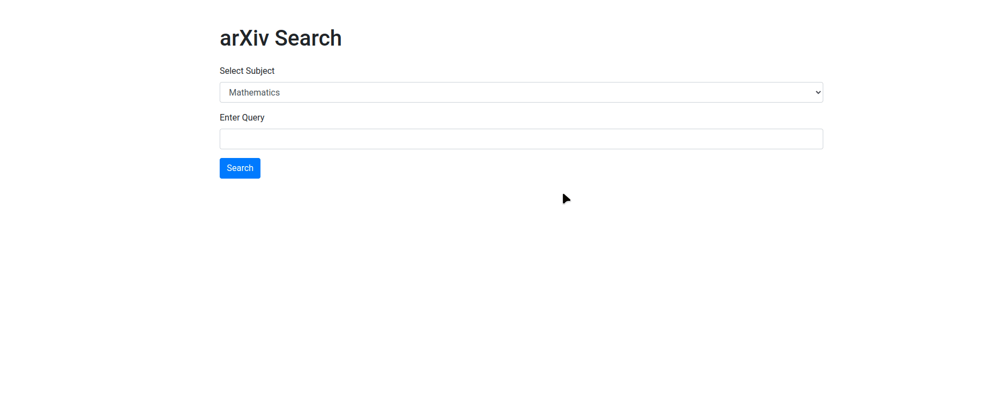

# Title: ArXiv Abstract Aggregation and Analysis using Machine Learning

## Objective: 

To build a web application that fetches scientific abstracts from ArXiv, processes them using a large language model (LLM) to generate aggregated summaries, and displays the results in a user-friendly format. This project demonstrates the integration of web scraping, API interaction, natural language processing (NLP), and web development.

## Key Components and Skills Demonstrated
1. Web Scraping and API Interaction
Description: Developed a script to interact with the ArXiv API to fetch research abstracts based on user queries.
Skills Demonstrated:
Understanding of HTTP requests and API interaction.
Proficiency in using Python libraries such as requests and BeautifulSoup.
Knowledge of query parameter construction and URL encoding.
2. Natural Language Processing (NLP)
Description: Utilized a large language model (LLM) to process and summarize the fetched abstracts.
Skills Demonstrated:
Experience with LLMs like GPT-4.
Text preprocessing and aggregation.
Creating prompts and interpreting model outputs.
Working with API keys and securing sensitive information using dotenv.
3. Web Development
Description: Built a Flask web application to provide a user interface for inputting queries and displaying results.
Skills Demonstrated:
Proficiency in Flask for web application development.
Front-end development using HTML, CSS, and JavaScript.
Implementing AJAX for asynchronous data fetching and rendering.
Validating user inputs and providing feedback.
4. Machine Learning Portfolio Relevance
Description: Justified the project as a practical application of machine learning in the domain of scientific literature analysis.

## Skills Demonstrated:
Applying ML models to solve real-world problems.
Demonstrating end-to-end project workflow from data acquisition to result presentation.
Highlighting problem-solving skills and the ability to deploy ML solutions.
Detailed Workflow
Data Acquisition

User inputs a query related to scientific research.
The application constructs an API request to ArXiv with the specified parameters.
Fetches up to 10 abstracts related to the query.
Data Processing

Extracts and aggregates the text of the abstracts.
Sends the aggregated text to an LLM for summarization.
Processes the LLM output to generate a concise summary.
Result Presentation

Displays the summary on a web page with a user-friendly layout.
Ensures responsive design and proper error handling.
Uses a loading spinner to improve user experience during data fetching.
Conclusion
This project is a comprehensive demonstration of your abilities to integrate multiple aspects of machine learning and web development. It showcases your proficiency in:

Extracting and processing data from APIs.
Using advanced NLP models to derive meaningful insights.
Building and deploying web applications to present data in an accessible manner.
